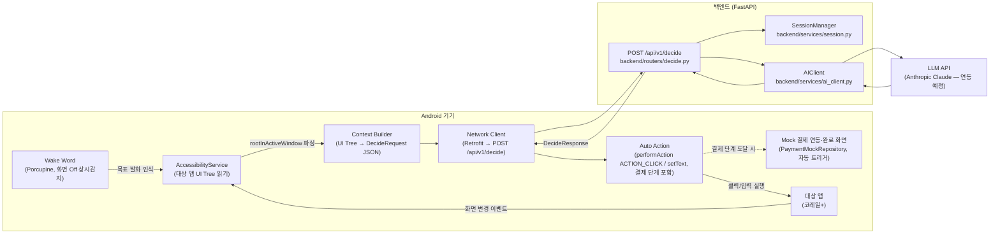

# 아키텍처 & 전체 파이프라인

이 문서는 팀원(사람)과 각자의 코딩 에이전트가 **동일한 최신 그림**을 보고 작업하도록 만든 단일 기준 문서다. 기획 배경/경쟁분석/BM은 `docs/planning/`을 보고, "지금 코드가 실제로 어떻게 동작하고 무엇을 만들어야 하는가"는 이 문서를 본다.

- 소스 오브 트루스 우선순위: **`CLAUDE.md`(규칙) > 이 문서(구조 설명) > `docs/planning/*.md`(기획 배경)**. 셋이 충돌하면 `CLAUDE.md`가 이긴다. 이 문서는 `CLAUDE.md`를 풀어서 설명하는 문서이지, 새 규칙을 만드는 문서가 아니다.
- 마지막 갱신 기준 커밋: `be9f6cb`
- 스키마/설정값은 실제 소스 코드(`backend/`)를 읽고 정리했다. 코드와 문서가 어긋나면 코드가 맞다 — 이 문서를 갱신해달라.

---

## 1. 한눈에 보는 시스템 구조



**핵심 한 줄**: Wake Word가 화면 Off 상태에서 발화를 인식하면, AccessibilityService가 대상 앱(코레일+) 화면을 읽어 백엔드에 보내고, 백엔드는 LLM에게 "다음에 클릭/입력할 요소 하나"만 판단시켜 돌려준다. Android는 그 판단을 목적지·시간·좌석 선택부터 결제까지 **중단 없이 그대로 실행(자동 클릭)한다**. 결제 자체는 실제 PG 연동 없이 앱 내부 Mock으로만 완료된다.

---

## 2. 담당 영역 및 파일 소유권 (3인 팀)

`main` 브랜치에 각자 직접 push하는 워크플로우이므로, **폴더 경계를 넘는 수정은 사전 협의 없이 하지 않는다** (`CLAUDE.md` §12). 코딩 에이전트에게 작업을 맡길 때도 아래 경계를 프롬프트에 명시할 것.

| 역할 | 담당 폴더 | 건드리면 안 되는 곳 |
|---|---|---|
| 백엔드 | `backend/` (routers, schemas, services, core, tests) | `android/` |
| Android | `android/` | `backend/` |
| AI/LLM | `backend/services/ai_client.py`, (신설 예정) 프롬프트 템플릿 파일 | `backend/routers/`, `android/` — 단, `ai_client.py`는 백엔드 담당자와 인터페이스(Protocol) 합의 필요 |

공용 파일(`CLAUDE.md`, 이 문서, `backend/schemas/*.py`)은 셋 다 참조하지만 **스키마를 바꾸는 PR은 반드시 셋 다에게 영향**이 가니 변경 전에 채팅으로 먼저 알릴 것.

---

## 3. End-to-End 시나리오 워크스루 — "내일 아침 서울에서 부산 가는 KTX 예매해줘"

1. **발화 인식**: 화면이 꺼진 상태에서 Wake Word 엔진(Porcupine)이 상시 감지 중이던 Foreground Service를 통해 발화를 캡처하고 STT로 텍스트화한다. `goal = "내일 아침 서울에서 부산 가는 KTX 예매해줘"`.
2. **앱 실행**: 서비스가 코레일+ 앱(`app_package`, 예: `com.korail.talk`)을 자동 실행한다.
3. **UI 읽기**: `AccessibilityService.onAccessibilityEvent` → `rootInActiveWindow`를 재귀 탐색해 클릭 가능/의미 있는 노드만 추려 `text`, `content_description`, `class_name`, `clickable`, `bounds`를 수집하고 세션 내 임시 `id`를 부여한다.
4. **요청 전송**: Context Builder가 이를 `DecideRequest`(§6)로 직렬화해 `POST /api/v1/decide` 호출.
5. **백엔드 처리** (§5 상세): 세션 history 로드 → LLM 호출(5초 타임아웃) → 로깅 → 세션 갱신 → `DecideResponse` 반환.
6. **실행**: 응답 `status`가 `CONTINUE`면 Android가 `target_node_id`에 해당하는 노드에 즉시 `performAction(ACTION_CLICK)` 또는 `setText`를 실행한다 — **AI가 직접 클릭한다.**
7. **반복**: 화면이 바뀌면(`TYPE_WINDOW_STATE_CHANGED`/`TYPE_WINDOW_CONTENT_CHANGED`, 디바운스 적용) 3~6단계를 반복 — 출발역 → 도착역 → 날짜 → 조회 → 열차 선택 → 좌석 선택 → 결제까지 **중단 없이** 자동 진행.
8. **Mock 결제 완료**: 결제 단계에 도달하면 실제 PG/코레일 API를 호출하지 않고, `PaymentMockRepository.completePayment()` 같은 로컬 코루틴이 1~2초 delay 후 더미 카드번호(`**** **** **** 1234`)와 "예매가 완료되었습니다" 화면을 자동으로 보여준다. 화면에는 반드시 "Demo/테스트" 표기를 남긴다.

---

## 4. Android 파이프라인 상세 (구현 단계 · Phase 0~7)

> **현재 상태: `android/`는 Android Studio 기본 템플릿뿐이며 아래는 전부 미구현이다.** 아래 순서를 그대로 지켜서 구현할 것 — 순서를 건너뛰면 디버깅이 매우 어려워진다 (`docs/planning/05` §5 원칙).

| Phase | 내용 | 완료 기준 |
|---|---|---|
| 0 | Porcupine wake word SDK 연동 + Foreground Service 등록. 접근성 설정으로 이동하는 버튼 | 화면 Off 상태에서 wake word로 앱 실행 |
| 1 | `AccessibilityService` 등록 (Manifest `<service>` + `res/xml/accessibility_service_config.xml`, `canRetrieveWindowContent=true`) | 시스템 설정에서 서비스 켜짐, `onAccessibilityEvent`에서 `packageName` 로그 출력 |
| 2 | `rootInActiveWindow` 재귀 탐색, `text/contentDescription/className/clickable/boundsInScreen` 덤프 | 코레일+ 실행 시 Logcat에 UI 정보 출력 |
| 3 | AI 없이 문자열 매칭 → `performAction(ACTION_CLICK)` 자동 클릭 검증 | 지정 문자열 버튼이 실제로 눌림 |
| 4 | 클릭 가능/의미있는 노드만 추려 session-local id 부여 → `goal + elements` JSON을 백엔드로 전송, 응답 수신 | 백엔드 응답으로 `target_node_id` 수신 확인 |
| 5 | 화면 변경 이벤트(디바운스) 감지 시 3~4 반복하는 루프 | 여러 단계 연속 자동 진행 |
| 6 | 결제 단계까지 자동 클릭 계속 진행 (중단 없음) | 결제 단계까지 도달 |
| 6-1 | Mock 결제수단 연동·완료 화면 자동 전환 (로컬 상태 전환만, 실 API 호출 없음) | "결제 완료" 더미 화면 표시 |
| 7 | (필요시) 좌석맵 등 텍스트 노드 없는 UI에 대해 Screenshot + Vision fallback | 접근성 라벨 없는 UI에서도 진행 가능 |

**필수 AndroidManifest 권한/선언 (현재 전부 없음)**: `INTERNET`, `BIND_ACCESSIBILITY_SERVICE`를 갖는 `<service>`, (Wake Word 상시 감지용) `FOREGROUND_SERVICE`, 오버레이용 `SYSTEM_ALERT_WINDOW`.

**네트워킹**: Retrofit(권장) + `model/Types.kt`(§6 스키마와 필드명 1:1 대응, snake_case 그대로 사용 — camelCase로 바꾸지 말 것).

---

## 5. 백엔드 파이프라인 상세 — `POST /api/v1/decide`

파일: `backend/routers/decide.py`. **아래는 실제 코드 기준**이며 `CLAUDE.md` §6에 적힌 10단계(safety 필터링/마스킹/confidence 게이트 포함) 서술과는 다르다 — `backend/services/safety.py`가 삭제되어 해당 로직이 현재 파이프라인에는 없다 (§9 알려진 갭 참고).

```
1. 요청 수신 및 pydantic 검증
   - elements 빈 배열 체크, bounds 정합성(left<right, top<bottom)은
     schemas/request.py의 validator에서 처리 (위반 시 422)
2. 세션 로드 — session_id로 history(최근 3개) 조회. 없으면 새 세션
3. LLM 호출 (5초 타임아웃)
   - 타임아웃 시: target_node_id=None, status="UNSUPPORTED", reason="AI 응답 지연" 즉시 반환
4. 로깅 — text/content_description 원문은 어떤 경우에도 로그에 남기지 않음
5. 세션 갱신 — 이번 step 결과를 history에 append, 최근 3개만 유지
6. 응답 반환
```

의존성 주입: `Depends(get_settings)`, `Depends(get_ai_client)` — 현재 `get_ai_client()`는 `MockAIClient()` 고정 반환 (`# TODO: 실제 LLM 클라이언트 구현체로 교체`).

---

## 6. API 계약 — 정확한 스키마

`backend/schemas/request.py` / `backend/schemas/response.py` 원문 그대로. **Android `model/Types.kt`는 반드시 이 필드명(snake_case)과 정확히 일치시킬 것** — 사전 기획 문서(`docs/planning/05`)의 camelCase(`targetNodeId`, `contentDescription`)는 초안이며 폐기됨.

```python
class ElementDTO(BaseModel):
    id: int
    text: str | None
    content_description: str | None
    class_name: str
    clickable: bool
    bounds: list[int]  # [left, top, right, bottom], left<right, top<bottom 필수

class HistoryEntry(BaseModel):
    step: int
    selected_text: str

class DecideRequest(BaseModel):
    session_id: str
    goal: str
    app_package: str
    elements: list[ElementDTO]     # 빈 배열 금지 (422)
    history: list[HistoryEntry] | None = None

class DecideResponse(BaseModel):
    target_node_id: int | None
    instruction: str
    confidence: float
    status: Literal["CONTINUE", "DONE", "ASK_USER", "UNSUPPORTED"]
    reason: str | None = None
```

> ⚠️ **`docs/planning/01`, `05`는 `status`에 `PAYMENT_GATE`가 있다고 가정하고, `action`(click/setText)·`value`(setText용 입력값) 필드도 요구한다.** `PAYMENT_GATE`는 결제 전 사용자 확인을 전제로 한 이전 설계이며 현재는 폐기됐다(§7 참고) — 다시 넣지 말 것. 다만 `action`/`value` 필드는 자동 클릭·자동 입력에 여전히 필요하며 현재 스키마에는 없다 — §9 참고.

**설정값** (`backend/config.py`, 하드코딩 금지 — 여기서만 관리):

```python
CONFIDENCE_THRESHOLD: float = 0.6
SESSION_TTL_MINUTES: int = 30
SENSITIVE_KEYWORDS: list[str] = ["송금","이체","결제","계좌","비밀번호","인증","삭제","탈퇴","주민번호","카드번호"]
```

---

## 7. 안전 설계 (`CLAUDE.md` §4 — 절대 준수)

1. 화면 데이터 비영속화: UI Tree는 요청 처리 중에만 메모리에 존재, 추론 직후 폐기, DB/파일 저장 금지
2. 보안 통제 우회 금지: Google Play 접근성 API 정책 준수 범위 내에서만 동작
3. 신뢰도 게이트: LLM confidence가 임계값(`0.6`) 미만이면 `status=ASK_USER`로 강제 override
4. 민감정보 마스킹: 비밀번호/주민번호/계좌번호 등은 LLM 전송 전 서버단에서 마스킹

**결제 실행도 자동화 대상이다** — 목적지~좌석 선택뿐 아니라 결제까지 AI가 중단 없이 자동 진행한다(`CLAUDE.md` §4-1). 결제 대기 확인 화면·사용자 확인 탭·자체 오버레이를 통한 결제 게이트는 더 이상 두지 않는다. 다만 실제 PG/코레일 결제 확정 API 연동은 여전히 스코프 밖이며, 결제는 Android 로컬 `PaymentMockRepository` Mock으로만 완료된다.

---

## 8. 세션 / 컨텍스트 관리

`backend/services/session.py` — 프로세스 메모리 내 `dict[str, SessionData]` (Redis 등 외부 인프라 사용 금지). `session_id`별로 최근 `history` 최대 3개만 유지, `SESSION_TTL_MINUTES`(30분) 지나면 `get_history` 호출 시 지연 삭제(lazy eviction). 멀티 워커로 uvicorn을 띄우면 세션이 워커 간 공유되지 않으므로 해커톤 스코프에서는 **단일 워커로만 실행**할 것.

---

## 9. 알려진 갭 / 다음 작업 (에이전트가 작업 전 반드시 읽을 것)

| 갭 | 영향 | 담당 |
|---|---|---|
| `backend/services/safety.py` 삭제됨 — 민감정보 마스킹/confidence 게이트가 파이프라인에 없음 (`CLAUDE.md` §4 위반 상태) | 안전 원칙 미충족. 재구현 방식(백엔드 규칙 vs 프롬프트 내 규칙) 결정 필요 | 백엔드 |
| `DecideResponse`에 `action`(click/setText)·`value`(setText 입력값) 필드 없음 | 자동 클릭뿐 아니라 텍스트 입력(출발역/도착역 등)까지 자동화하려면 스키마 확장 필요 | 백엔드 (스키마 변경 시 Android·AI 담당자에게 공지) |
| `backend/services/ai_client.py`가 `MockAIClient` 고정 (`target_node_id=1, confidence=0.99, CONTINUE` 하드코딩) | 실제 LLM 미연동. Anthropic API 연동 필요 | AI/LLM |
| `android/`가 기본 템플릿 상태 — AccessibilityService·자동클릭·네트워킹·Wake Word 전부 미구현 | §4 Phase 0~7 처음부터 구현 | Android |
| `request.history`가 요청에는 있지만 서버가 무시하고 자체 세션 history로 덮어씀 | 의도된 동작인지 재확인 | 백엔드 |
| `docs/planning/01`, `05`가 여전히 결제 게이트(사용자 확인 탭, `PAYMENT_GATE` 상태, 자체 오버레이)를 전제로 서술됨 | 완전 자동결제 방향(`CLAUDE.md` §4-1, 이 문서 §7)과 어긋남. `docs/planning` 갱신 필요 | 기획/전체 |

---

## 10. 실행 명령어

```bash
# 백엔드
pip install -r requirements.txt
uvicorn backend.main:app --reload --port 8000
pytest backend/tests

# Android
# (Android 담당자가 채울 것 — 현재 CLAUDE.md §10에도 비어 있음)
```

---

## 11. 관련 문서

- 규칙/계약의 최종 소스: [`CLAUDE.md`](../CLAUDE.md)
- 제품 배경: [`docs/planning/01_PRD_AI_Digital_Guide.md`](planning/01_PRD_AI_Digital_Guide.md)
- 구현 단계별 가이드(코딩 에이전트 프롬프트 예시 포함): [`docs/planning/05_Technical_Implementation_Guide.md`](planning/05_Technical_Implementation_Guide.md)
