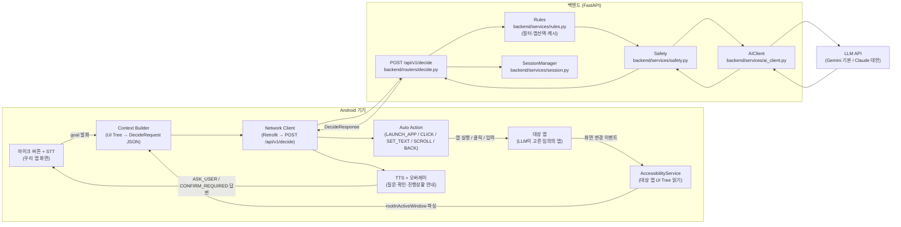
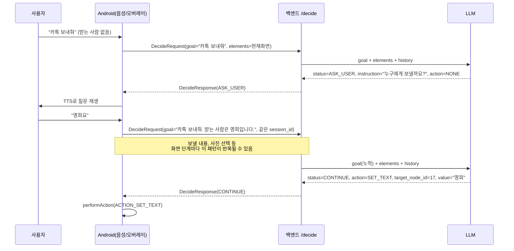
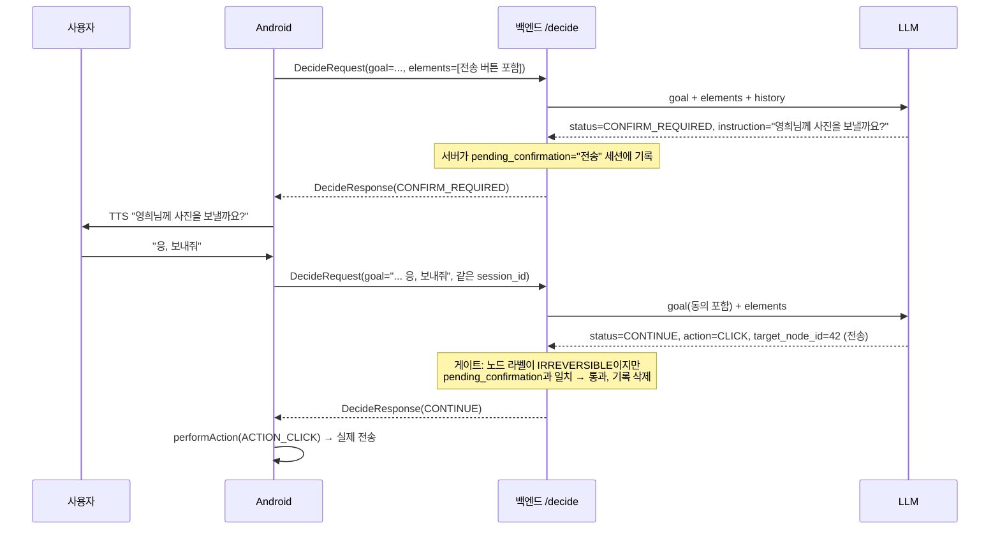

# 아키텍처 & 전체 파이프라인

이 문서는 팀원(사람)과 각자의 코딩 에이전트가 **동일한 최신 그림**을 보고 작업하도록 만든 단일 기준 문서다. 기획 배경/경쟁분석/BM은 `docs/planning/`을 보고, "지금 코드가 실제로 어떻게 동작하고 무엇을 만들어야 하는가"는 이 문서를 본다.

- 소스 오브 트루스 우선순위: **`CLAUDE.md`(규칙) > 이 문서(구조 설명) > `docs/planning/*.md`(기획 배경)**. 셋이 충돌하면 `CLAUDE.md`가 이긴다.
- 스키마/설정값은 실제 소스 코드(`backend/`)를 읽고 정리했다. 코드와 문서가 어긋나면 코드가 맞다 — 이 문서를 갱신해달라.

---

## 0. 제품 한 줄과 데모 한 줄 (헷갈리지 말 것)

| | 내용 |
|---|---|
| **제품** | 어르신이 앱 하나만 켜고 말하면, AI가 알맞은 앱을 스스로 찾아 열고 목표를 끝까지 수행한다. 되돌릴 수 없는 행동 직전에만 구두 동의를 구하고, 동의를 받으면 그 버튼까지 누른다. |
| **데모 (10시간)** | "영희한테 카톡으로 방금 찍은 사진 보내줘" → 카카오톡 자동 실행 → 친구 검색 → 대화방 → 사진 첨부 → 최근 사진 선택 → 구두 동의 → 전송 |

**데모는 제품의 한 사례일 뿐이다.** 카카오톡이라는 단어가 코드나 프롬프트에 등장하면 그건 버그다. 앱 선택조차 LLM이 설치된 앱 목록을 보고 하는 일이다 (§3 1단계).

---

## 1. 한눈에 보는 시스템 구조



**핵심 한 줄**: 사용자가 목표를 말하면 백엔드가 LLM에게 "설치된 앱 중 뭘 열까"를 먼저 묻고, 앱이 열린 뒤에는 화면마다 "다음에 뭘 누를까" 하나씩만 묻는다. 정보가 부족하면 되묻고(`ASK_USER`), 되돌릴 수 없는 버튼 앞에서는 구두 동의를 구한다(`CONFIRM_REQUIRED`).

---

## 2. 담당 영역 및 파일 소유권 (3인 팀)

`main` 브랜치에 각자 직접 push하는 워크플로우이므로, **폴더 경계를 넘는 수정은 사전 협의 없이 하지 않는다** (`CLAUDE.md` §12).

| 역할 | 담당 폴더 | 건드리면 안 되는 곳 |
|---|---|---|
| 백엔드 / AI | `backend/` 전체 (`services/ai_client.py`, `prompts/` 포함) | `android/` |
| Android — 권한·음성·UX | `android/` (권한 화면, STT/TTS, 오버레이, Retrofit) | `backend/` |
| Android — 접근성·자동조작 | `android/` (AccessibilityService, UI Tree 수집, 자동 실행부) | `backend/` |

공용 파일(`CLAUDE.md`, 이 문서, `backend/schemas/*.py`)은 셋 다 참조하지만 **스키마를 바꾸는 커밋은 반드시 셋 다에게 영향**이 가니 변경 전에 채팅으로 먼저 알릴 것.

---

## 3. End-to-End 워크스루 — "영희한테 카톡으로 방금 찍은 사진 보내줘"

1. **발화 수집**: 사용자가 우리 앱을 실행하고 큰 마이크 버튼을 탭한다. `SpeechRecognizer`가 발화를 텍스트로 만든다. `goal = "영희한테 카톡으로 방금 찍은 사진 보내줘"`.
2. **앱 선택**: Android가 `app_package=null`, `elements=[]`, `installed_apps=[{package, label}, ...]`로 첫 요청을 보낸다. LLM이 `action="LAUNCH_APP"`, `value="com.kakao.talk"`를 반환한다. **어떤 앱인지는 서버도 클라이언트도 모른다 — LLM이 고른다.**
3. **앱 실행**: `PackageManager.getLaunchIntentForPackage("com.kakao.talk")`로 실행. (Manifest `<queries>` 없으면 목록 자체가 비어 이 단계가 실패한다.)
4. **UI 읽기**: `onAccessibilityEvent` → `rootInActiveWindow`를 재귀 탐색해 의미 있는 노드만 추려 `text`, `content_description`, `class_name`, `clickable`, `editable`, `scrollable`, `password`, `bounds`를 수집하고 세션 내 임시 `id`를 부여한다.
5. **한 스텝 판단**: `DecideRequest`(§6)로 `POST /api/v1/decide`. LLM이 다음 한 가지 행동만 고른다.
6. **실행 & 반복**: `CONTINUE`면 Android가 `action`을 즉시 실행하고, 화면이 바뀌면(디바운스 적용) 4~5를 반복한다.
   - 친구 검색 아이콘 `CLICK` → 검색창에 `SET_TEXT "영희"` → 검색 결과 `CLICK` → 대화방 진입
   - 첨부(+) `CLICK` → 앨범 `CLICK` → 사진 그리드에서 가장 최근 사진 `CLICK`
7. **구두 동의**: 전송 버튼 차례가 되면 `status="CONFIRM_REQUIRED"`, `instruction="영희님께 사진을 보낼까요?"`. Android가 루프를 멈추고 TTS로 읽은 뒤 STT로 답변을 받는다.
8. **동의 후 실행**: `goal`에 `" 네, 보내주세요."`를 이어붙여 같은 `session_id`로 재요청 → LLM이 `CONTINUE` + 전송 버튼 `CLICK` → 서버 게이트가 `pending_confirmation` 일치를 확인하고 통과 → 실제 전송.
9. **종료**: 전송 완료 화면에서 LLM이 `status="DONE"`을 반환한다. Android가 루프를 멈추고 `instruction`을 TTS로 읽는다.

> 위 흐름은 첫 발화에 필요한 정보가 다 담긴 경우다. 실제로는 발화가 불충분한 경우가 기본값이므로 §3-1을 함께 볼 것.

---

## 3-1. 정보 부족 시 되묻기 (ASK_USER 슬롯필링)

사용자가 처음부터 완결된 문장을 말하는 경우는 오히려 예외다. **"카톡 보내줘"처럼 받는 사람·보낼 내용이 빠진 발화가 기본 전제**다. 상세 계약은 `CLAUDE.md` §5-1 참고.



- **판단 주체는 LLM**이다. 백엔드는 별도 슬롯 검증 로직 없이 LLM의 `ASK_USER` 응답을 그대로 통과시킨다. confidence 게이트로 인한 강제 override(§7)와는 별개의, LLM이 스스로 "이 화면에서 다음 행동을 확정할 정보가 없다"고 판단한 정상 응답이다.
- **답변은 `goal`에 이어붙여서 재요청한다.** 별도 필드를 추가하지 않는다 — `session_id`를 유지한 채 `goal = "{기존 goal}. {사용자 답변}"` 형태로 보낸다.

---

## 3-2. 되돌릴 수 없는 행동 앞 구두 동의 (CONFIRM_REQUIRED)

제품 정의의 핵심 문장 — **"결제 동의를 구두로 받으면 결제 버튼도 누른다"** — 이 그대로 구현되는 지점이다. 결제·송금·전송·삭제가 모두 같은 경로를 탄다.



- **2단 방어**: 1차는 LLM이 스스로 `CONFIRM_REQUIRED`를 낸다. 2차는 서버가 `IRREVERSIBLE_KEYWORDS`로 검사해, LLM이 빠뜨렸어도 `CONFIRM_REQUIRED`로 강제 override한다. **프롬프트 하나에 안전을 걸지 않는다.**
- **무한 루프 방지**: 서버가 `pending_confirmation`(확인을 요청한 노드의 라벨)을 세션에 기록한다. 다음 요청에서 LLM이 같은 노드에 `CONTINUE`를 내면 — 누적된 `goal`에서 동의를 읽었다는 뜻이므로 — 통과시키고 기록을 지운다. 이 장치가 없으면 서버가 영원히 다시 물어본다.
- **데모에서 실제 결제는 하지 않는다.** 전송 버튼이 결제 버튼과 **코드상 완전히 같은 경로**를 타므로, 돈을 쓰지 않고 결제 동의 UX를 그대로 시연할 수 있다. 발표에서 이 점을 명확히 말할 것 — "결제도 이것과 같은 코드로 동작한다".

---

## 4. Android 파이프라인 상세 (구현 단계 · Phase 0~6)

> **현재 상태: `android/`는 Android Studio 기본 템플릿뿐이며 아래는 전부 미구현이다.** 순서를 건너뛰면 디버깅이 매우 어려워진다.

| Phase | 내용 | 완료 기준 |
|---|---|---|
| 0 | 마이크 버튼 1개 화면 + `RECORD_AUDIO` 권한 + `SpeechRecognizer` STT + `TextToSpeech`. 접근성 설정으로 이동하는 버튼 | 버튼을 누르고 말하면 발화 텍스트가 Logcat에 뜨고, TTS로 문장이 읽힌다 |
| 1 | `AccessibilityService` 등록 (Manifest `<service>` + `res/xml/accessibility_service_config.xml`, `canRetrieveWindowContent=true`) | 시스템 설정에서 서비스 켜짐, `onAccessibilityEvent`에서 `packageName` 로그 출력 |
| 2 | `rootInActiveWindow` 재귀 탐색 → `text/contentDescription/className/clickable/editable/scrollable/isPassword/boundsInScreen` 덤프 | 카카오톡 실행 시 Logcat에 UI 정보 출력. **이 덤프를 백엔드 담당자에게 즉시 전달** (프롬프트 개발이 여기 의존) |
| 3 | AI 없이 문자열 매칭 → `ACTION_CLICK` / `ACTION_SET_TEXT` 자동 실행 검증 | 지정 문자열 버튼이 실제로 눌리고, 검색창에 글자가 들어간다 |
| 4 | `<queries>` 선언 + `PackageManager`로 설치 앱 목록 수집 + `getLaunchIntentForPackage`로 실행 | 패키지명을 주면 그 앱이 실행된다 |
| 5 | 의미 있는 노드만 추려 session-local id 부여 → `DecideRequest` 전송, 응답 `action` 분기 실행. `ASK_USER`/`CONFIRM_REQUIRED`면 루프 정지 → TTS 재생 → STT 답변 → `goal` 누적 후 재요청 | 백엔드 응답으로 한 스텝이 실행되고, 되묻기·동의 왕복이 동작 |
| 6 | 화면 변경 이벤트(`TYPE_WINDOW_STATE_CHANGED`/`TYPE_WINDOW_CONTENT_CHANGED`, 디바운스) 감지 시 4~5 반복하는 루프. `DONE`이면 종료 | 카톡 사진 전송이 발화 한 번으로 끝까지 진행 |
| 7 | (필요시) 접근성 라벨 없는 UI에 대해 Screenshot + Vision fallback | 사진 그리드처럼 라벨 없는 UI에서도 진행 가능 |

**필수 AndroidManifest 선언 (현재 전부 없음)**:
- 권한: `INTERNET`, `RECORD_AUDIO`
- `BIND_ACCESSIBILITY_SERVICE`를 갖는 `<service>` + `res/xml/accessibility_service_config.xml`
- **`<queries>`** — Android 11+ 패키지 가시성 제한 때문에 없으면 `PackageManager`가 설치된 앱을 못 본다. §3 2단계가 통째로 실패하므로 빠뜨리기 쉬운 1순위 함정이다.
- 오버레이는 `TYPE_ACCESSIBILITY_OVERLAY`를 쓰면 `SYSTEM_ALERT_WINDOW` 권한 요청이 불필요하다 — 어르신에게 보여줄 권한 화면이 하나 줄어든다.

**네트워킹**: Retrofit + OkHttp + kotlinx.serialization. `model/Types.kt`가 §6 스키마와 필드명 1:1 대응 (snake_case 그대로, camelCase로 바꾸지 말 것).

---

## 5. 백엔드 파이프라인 상세 — `POST /api/v1/decide`

파일: `backend/routers/decide.py`.

```
 1. 요청 수신 및 pydantic 검증
    - bounds 좌표 역전(left>right) 거절, app_package가 있으면 elements 빈 배열 금지
      → schemas/request.py의 validator (위반 시 422)
 2. 세션 로드 — history(최근 3개) + pending_confirmation + 결정 캐시
 3. 민감정보 마스킹 (services/safety.py)
 4. 규칙 필터링 (services/rules.py) — 레이아웃 컨테이너·중복·화면 밖 노드 제거
 5. 화면 지문 계산 + 반복 카운트

 ── 여기서부터 LLM을 부르지 않고 끝날 수 있다 (§5-1) ──
 6. 같은 화면 반복 초과      → UNSUPPORTED (루프 차단)
 7. 조작 가능 요소 없음      → CONTINUE + NONE (로딩 중, 대기)
 8. goal에서 앱 특정 가능    → LAUNCH_APP (콜 1회 절약)
 9. (goal, 화면지문) 캐시 적중 → 직전 결정 재사용
 ──────────────────────────────────────────────

10. LLM 호출 (타임아웃 초과 시 status=UNSUPPORTED로 즉시 정상 응답)
11. confidence 게이트 — 임계값 미만이면 ASK_USER로 강제 override
12. 되돌릴 수 없는 행동 게이트 — IRREVERSIBLE_KEYWORDS 매칭 & pending_confirmation 불일치면
    CONFIRM_REQUIRED로 강제 override (§3-2)
13. 응답 검증 — target_node_id 실재 여부, SET_TEXT인데 value 없음 등 → 위반 시 UNSUPPORTED
14. 로깅 — text/content_description 원문은 어떤 경우에도 로그에 남기지 않음
15. 세션 갱신
16. 응답 반환
```

> **게이트는 규칙 경로에도 적용된다.** 6~9번으로 LLM 없이 만들어진 응답도 11~13번을 그대로 통과한다. "규칙으로 빨리 처리했으니 안전 검사는 건너뛴다"가 되면 안 된다.

의존성 주입: `Depends(get_settings)`, `Depends(get_ai_client)`.

> **safety는 위험 요소를 LLM 목록에서 제외하지 않는다.** 이전 설계는 결제 관련 element를 필터링해 빼버렸는데, 그러면 "AI가 결제 버튼을 누른다"는 제품 정의가 성립하지 않는다. 지금 설계는 **빼는 대신 게이트를 건다**.

---

## 5-1. 규칙 계층 (`backend/services/rules.py`)

**화면 전환마다 LLM 1콜**인 구조라 콜 수와 콜당 토큰이 곧 원가이자 지연이다. LLM에게 물어보지 않아도 답이 정해진 것은 여기서 결정론적으로 끝낸다.

| 규칙 | 무엇을 하는가 | 효과 |
|---|---|---|
| `filter_elements` | 면적 0·순수 레이아웃 컨테이너·중복 라벨 제거, 읽기 순서 정렬 | **노드 63% 감소** (실측) |
| `build_llm_payload` | null 필드 제거, 클래스명 접두어 축약, 플래그 압축(`"ce"`) | **페이로드 문자수 80% 감소** (실측) |
| `resolve_app` | `goal`과 기기가 준 앱 라벨을 대조해 앱을 직접 특정 | **LLM 콜 1회 완전 제거** |
| 결정 캐시 | `(goal, 화면지문)`이 같으면 직전 결정 재사용 | 중복 이벤트로 인한 낭비 콜 제거 |
| `is_loading_screen` | 조작 가능 요소가 0개면 로딩 중 | 답이 없는 화면에 콜 낭비 안 함 |
| 반복 화면 차단 | 같은 지문이 N회 반복되면 중단 | 무한 루프 + 무한 과금 방지 |
| `needs_vision` | 라벨 없는 조작 노드 비율로 Vision 필요 여부 판정 | Vision을 상시가 아니라 필요할 때만 |

**실측 (`dumps/s1.xml`, 1080×2340 실기기 화면)**

| | 노드 | JSON 문자수 |
|---|---|---|
| 최적화 전 (전체 노드·전체 필드) | 75 | 14,488 |
| 최적화 후 (규칙 필터 + 압축) | 28 | 2,868 |
| **감소** | **63%** | **80%** |

### 규칙은 앱을 알지 못한다

`resolve_app`은 카카오톡을 모른다. **기기가 준 `installed_apps` 라벨**과 **사용자가 말한 `goal`**만 문자열로 대조한다. 한국어 조사("카톡**으로**")는 조사 사전 대신 **토큰의 접두어를 길이순으로 대조**해 처리한다 — "카톡"이 "카카오톡"의 부분수열이므로 매칭된다. 애매하거나 동점이면 `None`을 반환해 LLM에게 넘긴다(fail-safe).

### position_hint — 라벨 없는 항목을 Vision 없이 지목하기

사진 그리드처럼 셀에 `contentDescription`이 없는 화면에서도, **노드 자체는 트리에 존재한다**(익명일 뿐이다). `build_llm_payload`는 라벨 없는 clickable 노드에 읽기 순서 기반 힌트를 붙인다:

```json
{"id": 51, "class": "ImageView", "flags": "c", "position_hint": "이름 없는 1번째 항목", "bounds": [...]}
```

LLM은 "가장 최근 사진 = 1번째 항목"을 이걸로 고를 수 있다. **접근성 라벨이 없다고 곧바로 Vision이 필요한 것이 아니다** — 데모 최대 리스크였던 사진 그리드 문제를 규칙만으로 상당 부분 해소한다.

---

## 5-2. Vision 인코딩 vs UI Tree — 비교와 선택

### 세 가지 선택지

| | **A. UI Tree 전용** | **B. Vision 전용** | **C. Tree 우선 + Vision fallback** |
|---|---|---|---|
| 화면 이해 | 접근성 노드의 text/contentDescription | 스크린샷을 멀티모달 모델이 판독 | A + 필요한 화면에서만 B |
| 실행 방식 | `performAction(ACTION_CLICK)` — **노드 지정** | `dispatchGesture` — **좌표 탭** | 노드 지정 |
| 라벨 없는 UI | 취약 (단, position_hint로 상당 부분 커버) | 강함 | 강함 |
| 실행 정확도 | **높음** — 좌표 오차 개념이 없음 | 낮음 — 좌표 오차·스크롤/애니메이션 중 좌표 변위 | 높음 |
| 콜당 입력 토큰 | 실측 2,868자 → **대략 1~2K 토큰** | 1080×2340 이미지 → **대략 3~5K 토큰**(추정) + 텍스트 | A + 필요 화면만 가산 |
| 지연 | 가장 낮음 | 이미지 인코딩·전송·판독으로 증가 | A와 거의 동일 |
| 앱 비종속성 | 앱의 접근성 구현에 의존 | 앱과 무관 | 앱 의존을 Vision으로 보완 |

### 결정: C (Tree 우선 + 규칙으로 트리거되는 Vision)

**핵심은 "Vision이 Tree의 대안이 아니라 추가"라는 점이다.**

안정적으로 *실행*하려면 노드 핸들이 필요하다(`performAction`). 좌표 탭은 스크롤·애니메이션·기기 해상도 차이에서 어긋난다. 즉 **어차피 트리를 읽어야 한다.** Vision은 트리가 이름 붙이지 못한 노드에 의미를 얹어줄 뿐이므로, 비용은 항상 `Tree + 이미지`다. Vision을 켠다고 Tree 비용이 줄지 않는다.

따라서 **B(Vision 전용)는 더 비싸고 더 느리면서 실행 정확도까지 낮다** — 접근성 서비스를 쓸 수 없는 환경이 아니라면 선택할 이유가 없다.

**Vision은 규칙으로 트리거한다** (`rules.needs_vision`): 조작 가능 노드 중 라벨 없는 비율이 `VISION_UNLABELED_RATIO`(기본 0.6) 이상인 화면에서만 스크린샷을 덧붙인다. 매 스텝 켜면 작업당 원가가 몇 배로 뛴다.

> **토큰 수치는 추정이다.** 문자수(2,868자)는 실측이지만 토큰 변환은 하지 않았다. API 키가 생기면 아래로 실제 값을 재보고 이 표를 갱신할 것 — 추정으로 원가를 계산하지 말 것.
> ```python
> client.messages.count_tokens(model="claude-opus-5", messages=[...])
> ```
> 이미지 토큰은 모델 세대에 따라 다르다. Opus 5는 긴 변 2576px까지 원본 해상도를 받으므로 1080×2340 스크린샷이 다운스케일 없이 들어가고, 그만큼 토큰이 크다. 비용이 문제면 클라이언트에서 720p로 줄여 보내는 것이 가장 직접적인 절감이다.

---

## 6. API 계약 — 정확한 스키마 (v2)

`backend/schemas/request.py` / `backend/schemas/response.py` 원문 그대로. **Android `model/Types.kt`는 반드시 이 필드명(snake_case)과 정확히 일치시킬 것.**

```python
class ElementDTO(BaseModel):
    id: int
    text: str | None
    content_description: str | None
    class_name: str
    clickable: bool
    editable: bool                   # ACTION_SET_TEXT 가능 여부
    scrollable: bool
    password: bool = False           # 비밀번호 필드 — text는 보내지 말 것
    bounds: list[int]                # [left, top, right, bottom], left<right, top<bottom 필수

class InstalledApp(BaseModel):
    package: str
    label: str

class HistoryEntry(BaseModel):
    step: int
    action: str
    selected_text: str

class DecideRequest(BaseModel):
    session_id: str
    goal: str
    app_package: str | None                            # None = 대상 앱 미실행
    elements: list[ElementDTO]                         # app_package가 있으면 빈 배열 금지 (422)
    installed_apps: list[InstalledApp] | None = None   # app_package가 None일 때만 전송
    history: list[HistoryEntry] | None = None

class DecideResponse(BaseModel):
    action: Literal["CLICK", "SET_TEXT", "LAUNCH_APP",
                    "SCROLL_FORWARD", "SCROLL_BACKWARD", "BACK", "NONE"]
    target_node_id: int | None
    value: str | None                # SET_TEXT의 입력값 / LAUNCH_APP의 패키지명
    instruction: str                 # TTS로 읽어줄 문장
    confidence: float
    status: Literal["CONTINUE", "DONE", "ASK_USER", "CONFIRM_REQUIRED", "UNSUPPORTED"]
    reason: str | None = None
```

**v1 초안 대비 달라진 것** (이전 문서를 기억하는 사람을 위해):

| v1 초안 | v2 | 왜 |
|---|---|---|
| `ui_tree` / `node_id: str` / `content_desc` | `elements` / `id: int` / `content_description` | 필드명 통일. 두 계약이 코드 안에서 갈라져 있던 문제 해소 |
| `decision` 중첩 객체, `voice_message` | 최상위 `action`/`value`, `instruction` | 중첩 제거, TTS 문구 이름 통일 |
| (없음) | `action`, `value` | 자동 클릭만으로는 텍스트 입력·앱 실행을 표현할 수 없음 |
| (없음) | `LAUNCH_APP`, `installed_apps` | 앱을 AI가 고르는 것이 제품의 본질 |
| `WAIT_FOR_CONFIRM` | `CONFIRM_REQUIRED` | 이름만 정리. 구두 동의 게이트는 정식 스펙으로 복귀 |
| `user_speech` 별도 필드 | `goal` 누적 | 되묻기·동의 답변을 한 가지 방식으로 통일 |
| (없음) | `editable`, `scrollable`, `password` | setText 대상 판별, 목록 스크롤, 마스킹에 필요 |

**설정값** (`backend/config.py`, 하드코딩 금지 — 여기서만 관리):

```python
CONFIDENCE_THRESHOLD: float = 0.6
SESSION_TTL_MINUTES: int = 30
AI_CLIENT_TIMEOUT_SECONDS: float = 12.0
IRREVERSIBLE_KEYWORDS: list[str]   # 결제/송금/전송/삭제 등 — CONFIRM_REQUIRED 게이트
SENSITIVE_PATTERNS: list[str]      # 주민번호/카드번호/계좌번호 정규식 — 마스킹
```

---

## 7. 안전 설계 (`CLAUDE.md` §4 — 절대 준수)

1. 화면 데이터 비영속화: UI Tree는 요청 처리 중에만 메모리에 존재, 추론 직후 폐기, DB/파일 저장 금지
2. 보안 통제 우회 금지: Google Play 접근성 API 정책 준수 범위 내에서만 동작
3. 신뢰도 게이트: LLM confidence가 임계값(`0.6`) 미만이면 `status=ASK_USER`로 강제 override
4. 민감정보 마스킹: `password=true` 노드와 주민번호·카드번호·계좌번호 패턴은 LLM 전송 전 서버단에서 마스킹
5. 되돌릴 수 없는 행동 게이트: 결제·송금·전송·삭제 계열 노드 클릭은 구두 동의 없이 통과시키지 않음 (§3-2)

**결제도 자동화 대상이다** — 다만 그 직전에 구두 동의를 받는다(`CLAUDE.md` §4-1). Mock이 아니라 대상 앱의 실제 결제 화면을 그대로 자동 조작하며, 동의 후에는 실제 금전이 이동한다. 우리 backend/Android가 PG사 API를 직접 호출하는 별도 연동은 만들지 않는다.

---

## 8. 세션 / 컨텍스트 관리

`backend/services/session.py` — 프로세스 메모리 내 `dict[str, SessionData]` (Redis 등 외부 인프라 사용 금지). `session_id`별로:

- `history` 최근 3개
- `pending_confirmation` — 확인을 요청한 노드 라벨 (§3-2 무한 루프 방지)
- `SESSION_TTL_MINUTES`(30분) 경과 시 지연 삭제(lazy eviction)

멀티 워커로 uvicorn을 띄우면 세션이 워커 간 공유되지 않으므로 해커톤 스코프에서는 **단일 워커로만 실행**할 것.

---

## 9. 알려진 갭 / 다음 작업 (에이전트가 작업 전 반드시 읽을 것)

| 갭 | 영향 | 담당 |
|---|---|---|
| **LLM API 키 미보유** — 키가 없으면 `MockAIClient`로 동작한다 | 규칙·게이트는 실제로 돌지만 화면 탐색 판단이 부정확. `.env`에 `GEMINI_API_KEY`를 넣고 `python -m backend.dev.check_llm`으로 확인할 것 | 키 보유자 |
| `backend/prompts/decide_system.md` 미작성 | 앱 선택·되묻기·구두 동의 지시가 프롬프트에 없음 | 백엔드/AI |
| `android/`가 기본 템플릿 상태 — 마이크·STT/TTS·AccessibilityService·자동조작·`<queries>`·Retrofit 전부 미구현 | §4 Phase 0~6 처음부터 구현 | Android |
| **카카오톡 UI 덤프 없음** — `dumps/s1.xml`은 `com.android.settings` 화면 덤프라 쓸 수 없다 | 프롬프트 개발이 이걸 기다린다. Phase 2 완료 즉시 전달 필요 | Android(접근성) |
| Vision fallback 미구현 (Phase 7) | 사진 그리드처럼 접근성 라벨 없는 화면. **먼저 `position_hint`(§5-1)로 시도하고, 그래도 안 될 때만 착수** | 백엔드/AI |
| Android가 클라이언트단 노드 필터링을 안 함 | 백엔드가 필터하므로 동작엔 문제없지만 네트워크가 낭비됨. 면적 0·라벨없음+조작불가 노드는 보내기 전에 거를 것 | Android |
| `request.history`가 요청에는 있지만 서버가 자체 세션 history를 우선 사용 | 의도된 동작(클라이언트를 신뢰하지 않음). 클라이언트는 디버깅용으로만 채울 것 | 백엔드 |

---

## 10. 실행 명령어

```bash
# 백엔드
pip install -r requirements.txt
uvicorn backend.main:app --reload --port 8000   # 세션이 메모리에 있으므로 단일 워커
pytest backend/tests
```

```bash
# Android
# (Android 담당자가 채울 것 — 현재 CLAUDE.md §10에도 비어 있음)
```

---

## 11. 관련 문서

- 규칙/계약의 최종 소스: [`CLAUDE.md`](../CLAUDE.md)
- 제품 배경: [`docs/planning/01_PRD_AI_Digital_Guide.md`](planning/01_PRD_AI_Digital_Guide.md)
- 구현 단계별 가이드(코딩 에이전트 프롬프트 예시 포함): [`docs/planning/05_Technical_Implementation_Guide.md`](planning/05_Technical_Implementation_Guide.md)
