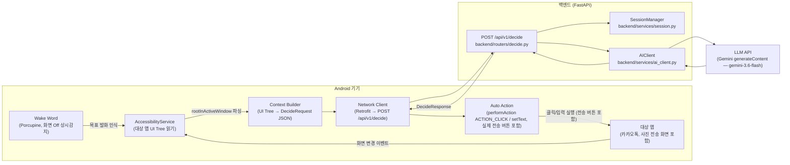
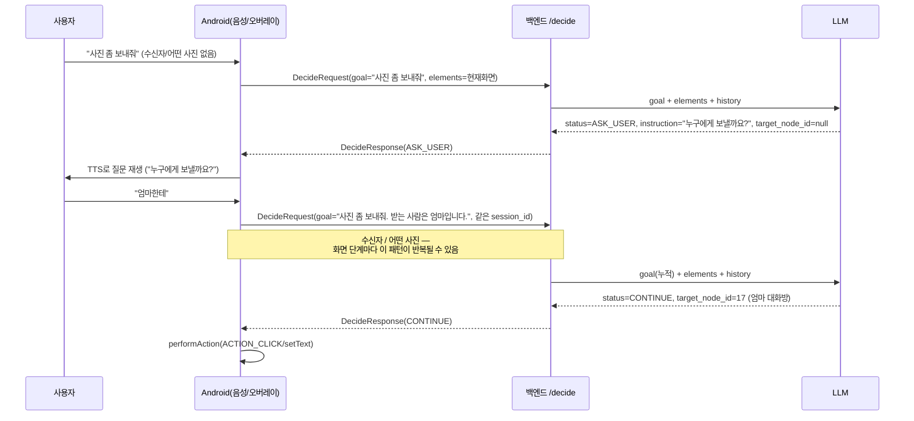

# 아키텍처 & 전체 파이프라인

이 문서는 팀원(사람)과 각자의 코딩 에이전트가 **동일한 최신 그림**을 보고 작업하도록 만든 단일 기준 문서다. 기획 배경/경쟁분석/BM은 `docs/planning/`을 보고, "지금 코드가 실제로 어떻게 동작하고 무엇을 만들어야 하는가"는 이 문서를 본다.

- 소스 오브 트루스 우선순위: **`CLAUDE.md`(규칙) > 이 문서(구조 설명) > `docs/planning/*.md`(기획 배경)**. 셋이 충돌하면 `CLAUDE.md`가 이긴다. 이 문서는 `CLAUDE.md`를 풀어서 설명하는 문서이지, 새 규칙을 만드는 문서가 아니다.
- 마지막 갱신 기준 커밋: `0f26964`
- 스키마/설정값은 실제 소스 코드(`backend/`)를 읽고 정리했다. 코드와 문서가 어긋나면 코드가 맞다 — 이 문서를 갱신해달라.

---

## 1. 한눈에 보는 시스템 구조



**핵심 한 줄**: Wake Word가 화면 Off 상태에서 발화를 인식하면, AccessibilityService가 대상 앱(카카오톡) 화면을 읽어 백엔드에 보내고, 백엔드는 LLM에게 "다음에 클릭/입력할 요소 하나"만 판단시켜 돌려준다. Android는 그 판단을 대화방 선택·사진 선택부터 **전송 버튼까지 중단 없이 그대로 실행(자동 클릭)한다** — Mock 화면이 아니라 카카오톡 앱의 실제 전송 플로우이며, **한 번 전송된 사진은 되돌릴 수 없다.**

---

## 2. 담당 영역 및 파일 소유권 (3인 팀)

`main` 브랜치에 각자 직접 push하는 워크플로우이므로, **폴더 경계를 넘는 수정은 사전 협의 없이 하지 않는다** (`CLAUDE.md` §12). 코딩 에이전트에게 작업을 맡길 때도 아래 경계를 프롬프트에 명시할 것.

| 역할 | 담당 폴더 | 건드리면 안 되는 곳 |
|---|---|---|
| 백엔드 | `backend/` (routers, schemas, services, core, tests) | `android/` |
| Android | `android/` | `backend/` |
| AI/LLM | `backend/services/ai_client.py`, (신설 예정) 프롬프트 템플릿 파일 | `backend/routers/`, `android/` — 단, `ai_client.py`는 백엔드 담당자와 인터페이스(Protocol) 합의 필요 |

공용 파일(`CLAUDE.md`, 이 문서, `backend/schemas/*.py`)은 셋 다 참조하지만 **스키마를 바꾸는 PR은 반드시 셋 다에게 영향**이 가니 변경 전에 채팅으로 먼저 알릴 것.

---

## 3. End-to-End 시나리오 워크스루 — "엄마한테 어제 찍은 사진 보내줘"

1. **발화 인식**: 화면이 꺼진 상태에서 Wake Word 엔진(Porcupine)이 상시 감지 중이던 Foreground Service를 통해 발화를 캡처하고 STT로 텍스트화한다. `goal = "엄마한테 어제 찍은 사진 보내줘"`.
2. **앱 실행**: 서비스가 카카오톡 앱(`app_package`, 예: `com.kakao.talk`)을 자동 실행한다.
3. **UI 읽기**: `AccessibilityService.onAccessibilityEvent` → `rootInActiveWindow`를 재귀 탐색해 클릭 가능/의미 있는 노드만 추려 `text`, `content_description`, `class_name`, `clickable`, `bounds`를 수집하고 세션 내 임시 `id`를 부여한다.
4. **요청 전송**: Context Builder가 이를 `DecideRequest`(§6)로 직렬화해 `POST /api/v1/decide` 호출.
5. **백엔드 처리** (§5 상세): 세션 history 로드 → LLM 호출 → 로깅 → 세션 갱신 → `DecideResponse` 반환.
6. **실행**: 응답 `status`가 `CONTINUE`면 Android가 `target_node_id`에 해당하는 노드에 즉시 `performAction(ACTION_CLICK)` 또는 `setText`를 실행한다 — **AI가 직접 클릭한다.**
7. **반복**: 화면이 바뀌면(`TYPE_WINDOW_STATE_CHANGED`/`TYPE_WINDOW_CONTENT_CHANGED`, 디바운스 적용) 3~6단계를 반복 — 채팅 목록 → 대화방 선택 → 첨부(+) → 앨범 → 사진 선택 → **전송 버튼**까지 **중단 없이** 자동 진행.
8. **실제 전송 완료**: 카카오톡 앱 자체의 사진 첨부·전송 화면이 그대로 실행되고, AI가 마지막 전송 버튼까지 `performAction(ACTION_CLICK)`으로 누른다. 우리 backend/Android는 별도의 메시지 전송 API 연동을 만들지 않는다 — 카카오톡 앱이 원래 갖고 있는 전송 흐름을 그대로 자동 조작할 뿐이다. **전송된 사진은 되돌릴 수 없다** — 대상을 잘못 고르면 사진이 이미 상대에게 도착한 뒤다.

> 위 흐름은 첫 발화에 필요한 정보가 다 담긴 "이상적인 경우"다. 실제로는 발화가 불충분한 경우가 기본값이므로 §3-1을 함께 볼 것.

---

## 3-1. 정보 부족 시 되묻기 (ASK_USER 슬롯필링)

사용자가 처음부터 "엄마한테 어제 찍은 사진 보내줘"처럼 완결된 문장을 말하는 경우는 오히려 예외다. **"사진 좀 보내줘"처럼 수신자·어떤 사진이 빠진 발화가 기본 전제**이며, 그때마다 AI가 되물어야 한다. 이 시나리오의 슬롯은 **① 수신자(누구에게) ② 어떤 사진** 둘뿐이라 왕복 횟수는 적지만, **둘 다 틀리면 되돌릴 수 없으므로** 추측으로 채우지 않는 것이 더 중요하다. 상세 계약은 `CLAUDE.md` §5-1 참고.



- **판단 주체는 LLM**이다. 백엔드는 별도 슬롯 검증 로직 없이 LLM의 `ASK_USER` 응답을 그대로 통과시킨다. 이는 confidence 게이트로 인한 강제 override(§7)와는 별개의, LLM이 스스로 "이 화면에서 다음 행동을 확정할 정보가 없다"고 판단한 정상 응답이다.
- `ASK_USER`일 때 `instruction`은 사용자에게 보여줄/들려줄 **질문 문장**이고 `target_node_id`는 보통 `null`이다(아직 클릭할 게 없음).
- **답변은 `goal`에 이어붙여서 재요청한다.** 별도 필드를 추가하지 않는다 — `session_id`를 유지한 채 `goal = "{기존 goal}. {사용자 답변}"` 형태로 다음 요청을 보낸다. LLM은 매번 전체 `goal` + 현재 `elements` + `history`를 같이 받으므로 누적된 문맥으로 판단할 수 있다.
- 사진 목록처럼 **화면에 선택지가 이미 나와 있는 항목**도 동일 패턴이다 — 사용자가 미리 말하지 않았다면 그 화면에 도달했을 때 LLM이 `ASK_USER`로 물어보고, 답변에 맞는 선택지를 `target_node_id`로 클릭한다(예: "맨 위 사진이 어제 찍은 것 같은데, 이걸 보낼까요?").
- **후보가 여럿이면 되묻는 것이 특히 중요하다.** "엄마"와 이름이 비슷한 대화방이 여러 개 있을 때 임의로 하나를 고르면 잘못된 상대에게 사진이 전송되고, 그건 취소할 수 없다. 백엔드 프롬프트(`backend/services/prompt.py`, v2)에 이 규칙이 명시돼 있다.
- Android 쪽 필요 구현: `ASK_USER` 수신 시 자동 클릭 루프를 멈추고 TTS 질문 재생 → STT로 답변 캡처 → `goal` 누적 후 재요청. §4 Phase 4~5에 포함.

---

## 4. Android 파이프라인 상세 (구현 단계 · Phase 0~7)

> **현재 상태: `android/`는 Android Studio 기본 템플릿뿐이며 아래는 전부 미구현이다.** 아래 순서를 그대로 지켜서 구현할 것 — 순서를 건너뛰면 디버깅이 매우 어려워진다 (`docs/planning/05` §5 원칙).

| Phase | 내용 | 완료 기준 |
|---|---|---|
| 0 | Porcupine wake word SDK 연동 + Foreground Service 등록. 접근성 설정으로 이동하는 버튼 | 화면 Off 상태에서 wake word로 앱 실행 |
| 1 | `AccessibilityService` 등록 (Manifest `<service>` + `res/xml/accessibility_service_config.xml`, `canRetrieveWindowContent=true`) | 시스템 설정에서 서비스 켜짐, `onAccessibilityEvent`에서 `packageName` 로그 출력 |
| 2 | `rootInActiveWindow` 재귀 탐색, `text/contentDescription/className/clickable/boundsInScreen` 덤프 | 카카오톡 실행 시 Logcat에 UI 정보 출력 |
| 3 | AI 없이 문자열 매칭 → `performAction(ACTION_CLICK)` 자동 클릭 검증 | 지정 문자열 버튼이 실제로 눌림 |
| 4 | 클릭 가능/의미있는 노드만 추려 session-local id 부여 → `goal + elements` JSON을 백엔드로 전송, 응답 수신. `status=ASK_USER`면 `instruction`을 TTS로 재생하고 STT로 답변을 받아 `goal`에 이어붙여 재요청 (§3-1) | 백엔드 응답으로 `target_node_id` 수신 확인, `ASK_USER` 왕복 확인 |
| 5 | 화면 변경 이벤트(디바운스) 감지 시 3~4 반복하는 루프 (되묻기 왕복 포함) | 여러 단계 연속 자동 진행 |
| 6 | 전송 버튼까지 자동 클릭 계속 진행 (중단 없음) — 카카오톡 앱 자체의 첨부·사진 선택·전송 화면을 그대로 자동 조작 | 실제 전송 완료까지 도달 |
| 7 | (필요시) 사진 썸네일 등 텍스트 노드 없는 UI에 대해 Screenshot + Vision fallback | 접근성 라벨 없는 UI에서도 진행 가능 |

**필수 AndroidManifest 권한/선언 (현재 전부 없음)**: `INTERNET`, `BIND_ACCESSIBILITY_SERVICE`를 갖는 `<service>`, (Wake Word 상시 감지용) `FOREGROUND_SERVICE`, 오버레이용 `SYSTEM_ALERT_WINDOW`.

**네트워킹**: Retrofit(권장) + `model/Types.kt`(§6 스키마와 필드명 1:1 대응, snake_case 그대로 사용 — camelCase로 바꾸지 말 것).

---

## 5. 백엔드 파이프라인 상세 — `POST /api/v1/decide`

파일: `backend/routers/decide.py`. 아래는 현재 코드와 1:1로 맞춘 실제 흐름이다.

```
1. 요청 검증 — elements 빈 배열, bounds 정합성(left<right, top<bottom)은
   schemas/request.py의 validator가 처리 (위반 시 422)
2. 민감 요소 탐지 — SENSITIVE_KEYWORDS 매칭 element를 세되 걸러내지 않음
   (§7: 전송 실행도 자동화 대상이므로 elements에서 제외하지 않는다)
3. 세션 로드 — 요청에 history가 실려 있으면 그걸 우선, 없으면
   session_id로 서버 세션에서 조회
4. 개인정보 마스킹 — LLM에 나가는 text/content_description에서
   전화번호/계좌번호/주민번호 패턴 제거 (mask_sensitive_text)
5. LLM 호출 — 동기 구현체를 asyncio.to_thread로 offload, 12초 타임아웃
   - asyncio.TimeoutError: status="UNSUPPORTED", reason="AI 응답 지연"
   - AIClientError(SDK 예외/파싱 실패): status="UNSUPPORTED", reason="AI 호출 실패"
     (상세 사유는 로그에만 남기고 응답 본문에는 노출하지 않음)
6. confidence 게이트 — CONFIDENCE_THRESHOLD 미만이면 ASK_USER로 강제 override
   (check_confidence)
7. 응답 검증 — target_node_id가 원본 elements에 실재하는지(validate_target_node_id),
   action_type/input_value 불변식이 맞는지(validate_action) 확인.
   위반 시 UNSUPPORTED로 강등
8. 로깅 — text/content_description 원문은 어떤 경우에도 로그에 남기지 않음
9. 세션 갱신 — 이번 step 결과 요약을 history에 append, 최근 3개만 유지
10. 응답 반환
```

의존성 주입: `Depends(get_settings)`, `Depends(get_ai_client)` — `get_ai_client()`는 `GEMINI_API_KEY` 유무로 `GeminiAIClient`/`MockAIClient`를 고른다. 클라이언트는 `lru_cache`로 프로세스당 한 번만 생성한다.

**타임아웃 구조**: 라우터가 `asyncio.wait_for`로 12초, SDK가 HTTP deadline으로 10초를 건다. SDK 쪽이 짧아야 HTTP가 먼저 끊기고 `to_thread` 스레드가 풀린다 — `wait_for`는 대기만 중단할 뿐 스레드를 실제로 끊지 못하기 때문이다. Gemini가 10초 미만 deadline을 400으로 거부하므로 그 아래로는 내릴 수 없다. 실측 응답은 콜당 2.4초라 이 값들은 예산이 아니라 안전망이다.

---

## 6. API 계약 — 정확한 스키마

`backend/schemas/request.py` / `backend/schemas/response.py` 원문 그대로. **Android `model/Types.kt`는 반드시 이 필드명(snake_case)과 정확히 일치시킬 것** — 사전 기획 문서(`docs/planning/05`)의 camelCase(`targetNodeId`, `contentDescription`)는 초안이며 폐기됨.

```python
class ElementDTO(BaseModel):
    id: int
    text: str | None
    content_description: str | None
    class_name: str
    clickable: bool
    bounds: list[int]  # [left, top, right, bottom], left<right, top<bottom 필수

class HistoryEntry(BaseModel):
    step: int
    selected_text: str

class DecideRequest(BaseModel):
    session_id: str
    goal: str
    app_package: str
    elements: list[ElementDTO] = Field(min_length=1)   # 빈 배열 금지 (422)
    user_speech: str | None = None      # 예/아니오 등 확인 응답
    history: list[HistoryEntry] | None = None          # 생략 시 서버가 session_id로 조회

class DecideResponse(BaseModel):
    target_node_id: int | None = None
    action_type: Literal["CLICK", "SET_TEXT"] | None = None
    input_value: str | None = None      # SET_TEXT일 때 입력할 값
    instruction: str                    # 로그/디버깅용 — 사용자에게 읽어주지 않음
    voice_message: str = ""             # TTS로 읽어줄 문구
    confidence: float                   # 0.0 ~ 1.0
    status: Literal["CONTINUE", "DONE", "ASK_USER", "UNSUPPORTED"]
    reason: str | None = None
```

**서버가 보장하는 불변식** (클라이언트는 신뢰해도 됨): `target_node_id != null`이면 `action_type != null`이고, `action_type == "SET_TEXT"`이면 `input_value != null`이다. LLM 응답이 이를 위반하면 서버가 `UNSUPPORTED`로 강등한다.

> ⚠️ **전송 직전 사용자 확인 게이트(별도 status)는 폐기됐다 — 다시 넣지 말 것.** 확인이 필요한 상황은 별도 게이트가 아니라 LLM의 `ASK_USER`로 처리한다.

**LLM 응답 스키마는 이 계약과 별개다.** `backend/schemas/llm.py`의 `LLMDecision`이 LLM이 직접 채우는 형식이며, 의도적으로 분리했다 — `UNSUPPORTED`는 서버 판정이라 LLM이 선택할 수 없어야 하고, null 대신 센티널(`-1`/`"NONE"`/`""`)을 써서 JSON Schema에 `anyOf`가 생기지 않게 했다(프로바이더별 스키마 지원 편차 회피). 변환은 `GeminiAIClient._to_decide_response()`가 한다.

**설정값** (`backend/config.py`, 하드코딩 금지 — 여기서만 관리):

```python
CONFIDENCE_THRESHOLD: float = 0.6
SESSION_TTL_MINUTES: int = 30
GEMINI_MODEL: str = "gemini-3.6-flash"       # 3.7-flash는 응답 29초라 사용 안 함
GEMINI_THINKING_LEVEL: Literal[...] = "low"  # medium은 정확도 동일, 지연만 1.8배
GEMINI_TIMEOUT_SECONDS: float = 10.0         # Gemini가 요구하는 최소 deadline
SENSITIVE_KEYWORDS: list[str] = ["전송","보내기","송금","이체","결제","계좌","비밀번호","인증","삭제","탈퇴","주민번호","카드번호"]
```

---

## 7. 안전 설계 (`CLAUDE.md` §4 — 절대 준수)

1. 화면 데이터 비영속화: UI Tree는 요청 처리 중에만 메모리에 존재, 추론 직후 폐기, DB/파일 저장 금지
2. 보안 통제 우회 금지: Google Play 접근성 API 정책 준수 범위 내에서만 동작
3. 신뢰도 게이트: LLM confidence가 임계값(`0.6`) 미만이면 `status=ASK_USER`로 강제 override
4. 민감정보 마스킹: 비밀번호/주민번호/계좌번호 등은 LLM 전송 전 서버단에서 마스킹

**전송 실행도 자동화 대상이다** — 대화방·사진 선택뿐 아니라 전송 버튼까지 AI가 중단 없이 자동 진행한다. 전송 대기 확인 화면·사용자 확인 탭 같은 별도 게이트는 두지 않는다. Mock이 아니라 **카카오톡 앱의 실제 전송 화면을 그대로 자동 조작한다.** 우리 backend/Android가 메시지 전송 API를 직접 호출하는 별도 연동은 만들지 않는다 — 어디까지나 그 앱 자체의 기존 전송 흐름을 접근성으로 클릭해서 타는 것이다.

**이 시나리오의 핵심 리스크는 "취소 불가능한 전송"이다.** 잘못된 상대에게 사진이 한 번 전송되면 되돌릴 방법이 없다 — 수수료를 내고서라도 취소할 수 있었던 예매와 달리, 여기엔 그런 되돌리기 수단 자체가 없다. 따라서 오판 비용이 사실상 무한대라고 보고 설계한다:

- 수신자 후보가 둘 이상이면 임의 선택 금지 → `ASK_USER`로 되묻는다 (§3-1).
- confidence는 보수적으로 매기고, 임계값(`0.6`) 미만이면 게이트가 `ASK_USER`로 강제 override한다.
- 사진(내용)은 사용자 사생활 그 자체이므로 UI Tree와 마찬가지로 저장하지 않는다.

이 리스크와 Google Play 접근성 정책 리스크는 `docs/planning/01` §리스크에 기록돼 있으니 데모/테스트 시 반드시 숙지할 것.

---

## 8. 세션 / 컨텍스트 관리

`backend/services/session.py` — 프로세스 메모리 내 `dict[str, SessionData]` (Redis 등 외부 인프라 사용 금지). `session_id`별로 최근 `history` 최대 3개만 유지, `SESSION_TTL_MINUTES`(30분) 지나면 `get_history` 호출 시 지연 삭제(lazy eviction). 멀티 워커로 uvicorn을 띄우면 세션이 워커 간 공유되지 않으므로 해커톤 스코프에서는 **단일 워커로만 실행**할 것.

---

## 9. 알려진 갭 / 다음 작업 (에이전트가 작업 전 반드시 읽을 것)

| 갭 | 영향 | 담당 |
|---|---|---|
| 카카오톡 사진 목록 썸네일이 `text`/`contentDescription` 없이 노출될 가능성 | "어떤 사진" 슬롯을 접근성 트리만으로 확정하지 못하면 Phase 7 Vision fallback이 필수 경로가 됨. 실기기에서 먼저 덤프 확인 필요 | Android |
| 수신자 후보가 여럿일 때(이름이 비슷한 대화방) 오전송 방지가 프롬프트 규칙(v2)에만 의존 — 서버단 결정론적 검증은 없음 | 실측으로는 모호한 목표 되묻기 성공률이 67%→100%가 되어 서버단 코드 없이도 해결됐다(측정 표본 5회). 다만 표본이 작으므로 실기기 덤프로 반복 검증할 것 — 회귀하면 그때 서버단 검증을 추가한다 | 백엔드 / AI-LLM |
| `android/`가 기본 템플릿 상태 — AccessibilityService·자동클릭·네트워킹·Wake Word 전부 미구현 | §4 Phase 0~7 처음부터 구현 | Android |
| Android에 카카오톡 실기기 UI Tree 덤프 기록 없음 | 대화방 목록/첨부(+)/앨범/전송 각 화면의 노드 구조를 모르면 프롬프트·디바운스 튜닝 불가 | Android |
| Android에 TTS 질문 재생 / STT 답변 캡처 / `goal` 누적 로직 없음 (§3-1) | `ASK_USER` 응답을 받아도 사용자에게 되물을 방법이 없음 | Android |

---

## 10. 실행 명령어

```bash
# 백엔드
pip install -r requirements.txt
uvicorn backend.main:app --reload --port 8000
pytest backend/tests

# Android
# (Android 담당자가 채울 것 — 현재 CLAUDE.md §10에도 비어 있음)
```

---

## 11. 관련 문서

- 규칙/계약의 최종 소스: [`CLAUDE.md`](../CLAUDE.md)
- API 계약 정본(v2.0): [`dumps/API_SPEC.md`](../dumps/API_SPEC.md)
- 팀 역할/체크리스트: [`dumps/TODO.md`](../dumps/TODO.md)
- 제품 배경: [`docs/planning/01_PRD_AI_Digital_Guide.md`](planning/01_PRD_AI_Digital_Guide.md)
- 구현 단계별 가이드(코딩 에이전트 프롬프트 예시 포함): [`docs/planning/05_Technical_Implementation_Guide.md`](planning/05_Technical_Implementation_Guide.md)
- 작업일지(실기기 디버깅 기록 등): [`docs/worklog/`](worklog/)
